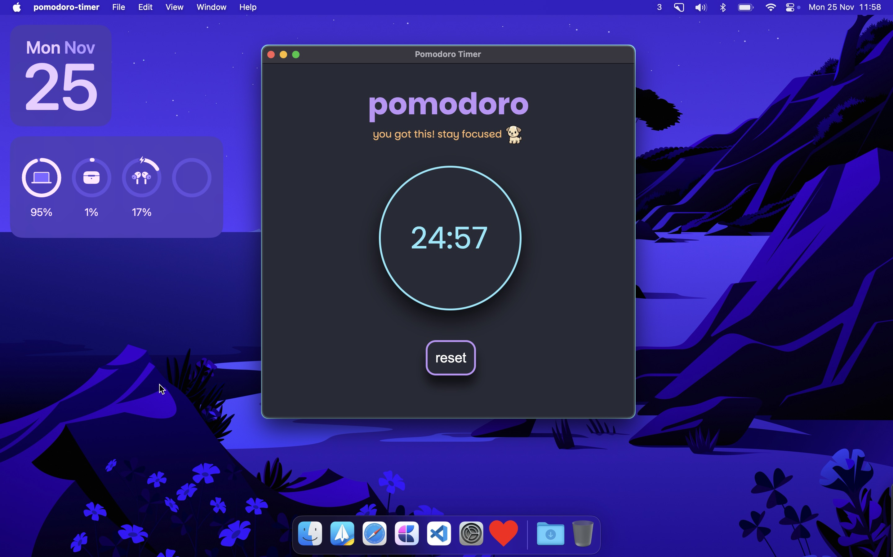

# cute-pomodoro-app

This is a simple pomodoro app built on electron. It features a 25 minute work session and a 5 minute break session and the ability to reset it.

# Demo
An image of the pomodoro timer

An image of it turned on

# Installation
It is currently only available on macOS but it can be easily built on other operating systems. If you can't do it yourself give me a shout I'll do it when I have the time
  
### Download for macOS Intel based chips
[Download v1.0.0](https://github.com/nlx-404/cute-pomodoro-app/releases/download/v1.0.0.0/pomodoro-timer-1.0.0-arm64.dmg)
### Download for macOS M chips
[Download v1.0.0](https://github.com/nlx-404/cute-pomodoro-app/releases/download/v1.0.0.0/pomodoro-timer-1.0.0-x64.dmg)
